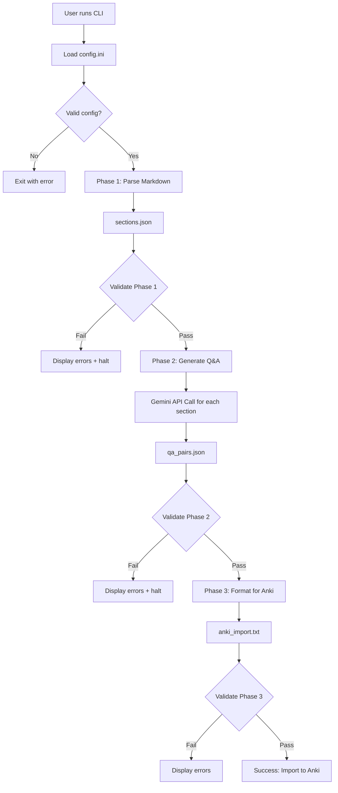
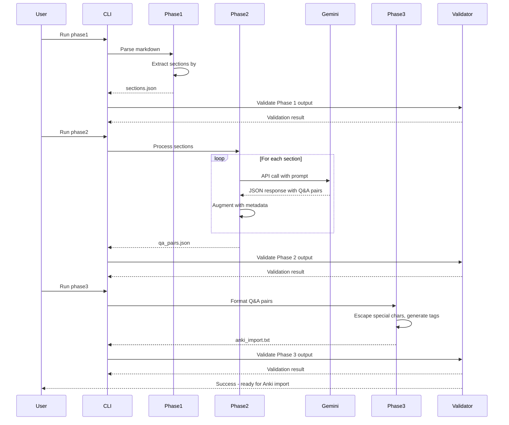
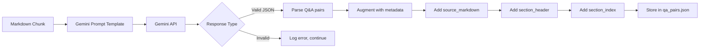

# Anki Card Generator - Comprehensive Specification

## Overview

A Python command-line application that transforms markdown study notes into Anki flashcards using Google Gemini API for intelligent question-answer generation. The system processes notes through a multi-phase pipeline with quality gates, automatic validation, and comprehensive testing at each stage.

**Primary Goal**: Convert bullet-point AWS study notes into granular, testable flashcards for active recall practice.

**Development Methodology**: Test-Driven Development (TDD) with unit tests written before implementation for each component.

---

## Functional Requirements

### FR1: Markdown Section Extraction (Phase 1)

**WHEN** the user provides a markdown file with `##` header delimiters
**THEN** the system SHALL parse the file and split it into separate markdown files, one per section

**WHEN** a section is extracted
**THEN** the system SHALL:
- Identify the `##` header line
- Extract all content from that header until the next `##` header (or end of file)
- Create a separate `.md` file for that section
- Use sanitized header text as the filename (e.g., `01_IAM.md`, `02_IAM_Policies.md`)
- Preserve the original markdown content exactly as-is (including the `##` header)

**WHEN** creating section filenames
**THEN** the system SHALL:
- Prefix with zero-padded index (e.g., `01_`, `02_`, `03_`)
- Sanitize header text (remove special chars, replace spaces with underscores)
- Limit filename to 50 characters (truncate if needed)
- Add `.md` extension

**IF** a section contains no bullet points (empty section)
**THEN** the system SHALL still create the file but log a warning

**WHEN** Phase 1 completes
**THEN** the system SHALL write output files to `{output_dir}/phase1_sections/`
**AND** create a manifest file `{output_dir}/phase1_sections/manifest.txt` listing all created files

**WHEN** Phase 1 validation runs
**THEN** the system SHALL verify:
- At least one section file was created
- All section files are valid UTF-8 markdown
- All section files contain a `##` header
- Manifest file exists and lists all section files
- No duplicate filenames exist

**IF** Phase 1 validation fails
**THEN** the system SHALL halt and display validation errors
**AND** Phase 2 SHALL NOT be allowed to run

**IF** Phase 1 validation passes
**THEN** the system SHALL allow manual review before Phase 2
**AND** Phase 2 MAY proceed even if manual review is skipped

---

### FR2: Question-Answer Generation via Gemini (Phase 2)

**WHEN** Phase 1 output is validated
**THEN** the system SHALL process each section file sequentially (no batching)

**WHEN** processing a section file
**THEN** the system SHALL:
- Read the section markdown file from `{output_dir}/phase1_sections/`
- Load the Gemini prompt template from `prompts/generate_qa.txt`
- Inject the entire markdown content (unaltered) into the prompt
- Check API cache for identical request before making API call
- Send individual API request to Google Gemini (if not cached)
- Parse structured JSON response
- Store request and response in API cache

**WHEN** Gemini returns a response
**THEN** the response SHALL contain a JSON array with objects having fields:
- `q`: The question text (string)
- `a`: The answer text (string)
- `aws_service`: AWS service name the question pertains to (string)

**WHEN** storing generated Q&A pairs
**THEN** the system SHALL augment each pair with metadata:
- `source_markdown`: The complete markdown content from the section file
- `section_header`: The `##` header from the section file
- `source_file`: The filename of the section file (e.g., `01_IAM.md`)

**WHEN** a Gemini API call fails (rate limit, network error, invalid response)
**THEN** the system SHALL:
- Log the error with section details
- Continue processing remaining sections
- Mark the section as failed in output

**WHEN** Phase 2 completes
**THEN** the system SHALL write output to `{output_dir}/phase2_qa_pairs/qa_pairs.json`
**AND** the system SHALL write processing statistics to `{output_dir}/phase2_qa_pairs/stats.json`

**WHEN** writing Phase 2 statistics
**THEN** the stats.json file SHALL contain:
- `total_sections`: Total number of sections processed (integer)
- `cache_hits`: Number of cached responses used (integer)
- `cache_misses`: Number of new API calls made (integer)
- `failures`: Number of failed API calls (integer)
- `total_qa_pairs`: Total Q&A pairs generated (integer)

**WHEN** Phase 2 validation runs
**THEN** the system SHALL verify:
- All Q&A pairs have non-empty `q` and `a` fields
- All Q&A pairs have valid `aws_service` field
- JSON structure is valid
- Each source section produced at least one Q&A pair
- No duplicate questions exist

**IF** Phase 2 validation fails
**THEN** the system SHALL halt and display validation errors
**AND** the system SHALL write failed items to `{output_dir}/phase2_qa_pairs/validation_failures.json`
**AND** Phase 3 SHALL NOT be allowed to run

**IF** Phase 2 validation passes
**THEN** the system SHALL allow manual review before Phase 3
**AND** Phase 3 MAY proceed even if manual review is skipped

---

### FR2A: API Request Caching

**WHEN** preparing to send a Gemini API request in Phase 2
**THEN** the system SHALL compute a hash of the request inputs

**WHEN** computing the request hash
**THEN** the hash SHALL include:
- The complete prompt text (after markdown content injection)
- The Gemini model name from configuration
- Any API parameters (temperature, token limits, etc.)

**WHEN** a request hash is computed
**THEN** the system SHALL check if a cache file exists at `api_cache/{hash}.json`

**IF** a cache file exists for the request hash
**THEN** the system SHALL:
- Load the cached response from the JSON file
- Use the cached response instead of making an API call
- Log that a cached response was used (e.g., "Using cached response for section 3")

**IF** no cache file exists for the request hash
**THEN** the system SHALL:
- Make the Gemini API call as normal
- Store both the request inputs and response in `api_cache/{hash}.json`
- Log that a new API call was made and cached

**WHEN** storing a cache entry
**THEN** the JSON file SHALL contain:
- `request_hash`: The computed hash (string)
- `timestamp`: When the request was made (ISO 8601 format)
- `model`: The Gemini model name used (string)
- `prompt`: The complete prompt sent to Gemini (string)
- `response`: The raw JSON response from Gemini (array of Q&A objects)
- `section_file`: The source section filename for reference (string)

**WHEN** the application starts
**THEN** the system SHALL create the `api_cache/` directory if it does not exist

**WHEN** computing hashes
**THEN** the system SHALL use SHA-256 algorithm for consistent, collision-resistant hashing

**Cache File Example** (`api_cache/a3f2b9c1d4e5f6a7b8c9d0e1f2a3b4c5d6e7f8a9b0c1d2e3f4a5b6c7d8e9f0a1.json`):
```json
{
  "request_hash": "a3f2b9c1d4e5f6a7b8c9d0e1f2a3b4c5d6e7f8a9b0c1d2e3f4a5b6c7d8e9f0a1",
  "timestamp": "2025-10-01T14:25:03Z",
  "model": "gemini-1.5-flash",
  "prompt": "You are an expert at creating Anki flashcards...\n\n---\n## IAM\n\n- policy deep dive...",
  "response": [
    {
      "q": "What is the Confused Deputy Problem?",
      "a": "When a lesser-privileged role coerces another role to perform an action.",
      "aws_service": "IAM"
    }
  ],
  "section_file": "01_IAM.md"
}
```

**Note**: The `api_cache/` directory SHOULD be git-ignored to avoid committing potentially large cache files, but MAY be committed if caching across machines is desired.

---

### FR3: Anki Import File Generation (Phase 3)

**WHEN** Phase 2 output is validated
**THEN** the system SHALL transform Q&A pairs into Anki-compatible tab-separated format

**WHEN** generating each flashcard line
**THEN** the format SHALL be:
```
{question}\t{answer}\t{tags}
```

**WHEN** generating tags
**THEN** tags SHALL be space-separated and include:
- `aws_service:{service_name}` (e.g., `aws_service:IAM`)
- `section:{sanitized_section_header}` (e.g., `section:Identity_and_Federation`)

**WHEN** generating flashcard content
**THEN** the system SHALL:
- Escape tab characters in questions/answers (replace with 4 spaces)
- Escape newline characters in questions/answers (replace with `<br>`)
- Preserve HTML formatting if present in Gemini output
- Sanitize tag values (replace spaces with underscores, remove special chars)

**WHEN** Phase 3 completes
**THEN** the system SHALL write output to `{output_dir}/phase3_anki/anki_import.txt`

**WHEN** Phase 3 validation runs
**THEN** the system SHALL verify:
- All lines have exactly 3 tab-separated fields
- No lines are empty
- All tags are properly formatted
- File is valid UTF-8 encoding
- Line count matches Q&A pair count from Phase 2

**IF** Phase 3 validation fails
**THEN** the system SHALL halt and display validation errors
**AND** the system SHALL write failed items to `{output_dir}/phase3_anki/validation_failures.txt`

**IF** Phase 3 validation passes
**THEN** the system SHALL display success message with file path
**AND** the user MAY import `anki_import.txt` into Anki manually

---

### FR4: Question Generation Strategy

**WHEN** Gemini processes a markdown chunk
**THEN** Gemini SHALL generate questions following these rules:

**Rule 1: Granularity**
- Each flashcard asks ONE specific, quickly-answerable question
- Avoid multi-part questions (no "Explain X, Y, and Z")
- Target answer length: 1-3 sentences maximum

**Rule 2: Volume and Selectivity**
- Generate multiple Q&A pairs from each markdown chunk (aim for high volume)
- Generate multiple question phrasings for important concepts
- Example: "What is X?", "When would you use X?", "Why is X important?"
- **NOT every bullet point needs a Q&A pair** - use intelligent judgment
- Skip bullet points that are commentary/meta-notes (e.g., "we covered this before", "not going through basics again")
- Skip bullet points that lack sufficient context when isolated from parent bullets

**Rule 3: Grouping and Context**
- Intelligently group related bullets when they form a complete concept
- PREFER fewer bullets per card (1-2 bullets ideal, 3 maximum)
- Parent-child indented bullets SHOULD be grouped to preserve context
- **Child bullets often cannot stand alone** - include parent context when needed
- The entire markdown section remains in `source_markdown` even if some bullets don't generate Q&A

**Rule 4: Question Types**
Generate diverse question types:
- **Definitional**: "What is [concept]?"
- **Procedural**: "How do you [action]?"
- **Contextual**: "When should you use [feature]?"
- **Comparative**: "What is the difference between X and Y?"
- **Troubleshooting**: "What causes [problem]?"

**Example Input**:
```markdown
## IAM

- not going to go through IAM basics again
- policy deep dive / anatomy
  - example policies for various services and scenarios
  - should understand these to get an idea of IAM's power
- Confused Deputy Problem is when lesser-privileged role coerces another role to perform an action
  - cross-account or cross-service third parties are the culprits usually
  - for example, solved by the "external ID" in an IAM Role Trust Policy
```

**Example Output** (multiple cards, commentary skipped):
```json
[
  {
    "q": "What should you understand about IAM policy examples?",
    "a": "You should understand example policies for various services and scenarios to get an idea of IAM's power.",
    "aws_service": "IAM"
  },
  {
    "q": "What is the Confused Deputy Problem in AWS IAM?",
    "a": "When a lesser-privileged role coerces another role to perform an action, typically involving cross-account or cross-service third parties.",
    "aws_service": "IAM"
  },
  {
    "q": "How is the Confused Deputy Problem solved in AWS?",
    "a": "Using an external ID in an IAM Role Trust Policy.",
    "aws_service": "IAM"
  },
  {
    "q": "What types of third parties typically cause the Confused Deputy Problem?",
    "a": "Cross-account or cross-service third parties.",
    "aws_service": "IAM"
  }
]
```

**Note**: The bullet "not going to go through IAM basics again" was SKIPPED because it's commentary/meta-note. However, it still appears in the `source_markdown` metadata for all generated cards.

---

### FR5: Configuration Management

**WHEN** the application starts
**THEN** the system SHALL load configuration from `config.ini` in project root

**WHEN** `config.ini` is missing
**THEN** the system SHALL display error message and exit
**AND** the system SHALL print example configuration format

**Configuration File Structure** (`config.ini`):
```ini
[gemini]
api_key = YOUR_GEMINI_API_KEY_HERE
model = gemini-1.5-flash

[paths]
input_file = /path/to/your/notes.md
output_dir = ./output

[prompts]
prompt_dir = ./prompts
```

**WHEN** required configuration values are missing
**THEN** the system SHALL display specific missing values and exit

**WHEN** `config.ini` exists
**THEN** the system SHALL validate:
- `api_key` is non-empty string
- `model` is valid Gemini model name
- `input_file` path exists and is readable
- `output_dir` path exists or can be created
- `prompt_dir` path exists

---

### FR6: Command-Line Interface

**WHEN** the user runs the application
**THEN** the system SHALL provide phase-specific commands

**Command Structure**:
```bash
# Run specific phase
python -m anki_generator.main phase1
python -m anki_generator.main phase2
python -m anki_generator.main phase3

# Run all phases sequentially
python -m anki_generator.main all

# Validate specific phase output (without running)
python -m anki_generator.main validate1
python -m anki_generator.main validate2
python -m anki_generator.main validate3

# Display statistics for all phases
python -m anki_generator.main stats
```

**WHEN** user runs `phase2` without `phase1` completion
**THEN** the system SHALL check for `phase1_sections/sections.json`
**AND** IF missing, display error: "Phase 1 must complete successfully before Phase 2"

**WHEN** user runs `phase3` without `phase2` completion
**THEN** the system SHALL check for `phase2_qa_pairs/qa_pairs.json`
**AND** IF missing, display error: "Phase 2 must complete successfully before Phase 3"

**WHEN** running `all` command
**THEN** the system SHALL:
- Execute phase1, run validation
- If validation passes, execute phase2, run validation
- If validation passes, execute phase3, run validation
- Halt at first validation failure

**WHEN** validation fails
**THEN** the system SHALL display:
- Number of items that failed
- Path to validation failures file
- First 5 failure examples with details

---

### FR7: Pipeline Statistics Reporting

**WHEN** the user runs `python -m anki_generator.main stats`
**THEN** the system SHALL analyze all phase outputs and display comprehensive statistics

**WHEN** computing Phase 1 statistics
**THEN** the system SHALL report:
- Total number of section files created
- List of section filenames with their sizes (in lines or bytes)

**WHEN** computing Phase 2 statistics
**THEN** the system SHALL report:
- Total number of sections processed
- Number of successful API calls (new requests)
- Number of cached responses used (cache hits)
- Number of failed API calls
- Total Q&A pairs generated
- Average Q&A pairs per section
- Breakdown by AWS service (count of Q&A pairs per service)

**WHEN** computing Phase 3 statistics
**THEN** the system SHALL report:
- Total number of Anki cards formatted
- Total number of unique tags generated
- File size of anki_import.txt

**WHEN** computing cache statistics
**THEN** the system SHALL report:
- Total number of cached API responses in `api_cache/`
- Total cache size (in MB)
- Oldest and newest cache entries (by timestamp)

**WHEN** displaying statistics
**THEN** the output SHALL be formatted as a clean, readable table or structured text

**Statistics Output Format**:
```
=============================================================
ANKI CARD GENERATOR - PIPELINE STATISTICS
=============================================================

PHASE 1: MARKDOWN SECTION EXTRACTION
-------------------------------------------------------------
Total Sections Created:        18
Average Section Size:          45 lines

Section Files:
  01_IAM.md                    32 lines
  02_08-15-2025_Reviewing...   58 lines
  03_IAM_Policies.md           41 lines
  ...

=============================================================
PHASE 2: Q&A GENERATION (GEMINI API)
=============================================================

Processing Summary:
  Total Sections Processed:    18
  Successful API Calls:        12  (new requests)
  Cached Responses Used:       6   (cache hits)
  Failed API Calls:            0

Q&A Pair Generation:
  Total Q&A Pairs Generated:   187
  Average per Section:         10.4

Breakdown by AWS Service:
  IAM:                         45 cards
  S3:                          32 cards
  EC2:                         28 cards
  ...

=============================================================
PHASE 3: ANKI FORMATTING
=============================================================

Output Summary:
  Total Anki Cards:            187
  Unique Tags:                 25
  Output File Size:            24.5 KB

=============================================================
API CACHE STATISTICS
=============================================================

Cache Summary:
  Total Cached Responses:      12
  Total Cache Size:            156 KB
  Cache Hit Rate:              33.3%

Cache Age:
  Oldest Entry:                2025-10-01 14:25:03
  Newest Entry:                2025-10-03 09:15:42

=============================================================
```

**IF** any phase has not been run yet
**THEN** the system SHALL display "Not yet run" for that phase's statistics

**IF** the output directory does not exist
**THEN** the system SHALL display error: "No pipeline data found. Run phases first."

---

### FR8: Gemini Prompt Template

**Prompt Template Location**: `prompts/generate_qa.txt`

**Template Structure**:
```
You are an expert at creating Anki flashcards for technical study material.

Your task is to transform AWS study notes into question-answer pairs for active recall practice.

RULES:
1. Create granular flashcards - each card should ask ONE specific question
2. Generate MULTIPLE Q&A pairs from the notes (aim for high volume of quality cards)
3. Create multiple question phrasings for important concepts (definitional, procedural, contextual)
4. Keep answers concise (1-3 sentences maximum)
5. Use intelligent judgment - NOT every bullet needs a Q&A pair:
   - SKIP commentary/meta-notes (e.g., "covered this before", "not going through basics")
   - SKIP bullets that lack context when isolated
   - GROUP parent-child indented bullets to preserve context
6. Group related bullets when they form a complete concept (prefer 1-2 bullets per card, max 3)
7. Do NOT add information not present in the notes
8. Extract the AWS service name for each question

REQUIRED OUTPUT FORMAT (valid JSON array):
[
  {
    "q": "question text here",
    "a": "answer text here",
    "aws_service": "service name (e.g., IAM, S3, EC2)"
  }
]

NOTES TO TRANSFORM:
---
{{MARKDOWN_CONTENT}}
---

Generate the flashcards now as a JSON array:
```

**WHEN** Phase 2 processes a section
**THEN** the system SHALL replace `{{MARKDOWN_CONTENT}}` with the section's markdown

---

## Non-Functional Requirements

### NFR1: Architecture

**Component Structure**:
```
src/anki_generator/
├── __init__.py
├── main.py                 # CLI entry point, phase orchestration
├── config.py               # Configuration loading and validation
├── phase1_parser.py        # Markdown section extraction
├── phase2_generator.py     # Gemini API integration and Q&A generation
├── phase3_formatter.py     # Anki format conversion
├── gemini_client.py        # Gemini API client wrapper
├── api_cache.py            # API request/response caching with hash-based lookup
├── statistics.py           # Statistics computation and reporting
├── validators.py           # Validation logic for each phase
└── models.py               # Data models (Section, QAPair, etc.)
```

**Data Flow**:
```
config.ini → Config object
input.md → Phase1Parser → sections.json
sections.json → Phase2Generator → ApiCache (check) → GeminiClient (if cache miss) → ApiCache (store) → qa_pairs.json
qa_pairs.json → Phase3Formatter → anki_import.txt
```

**Design Principles**:
- Single Responsibility: Each module handles one phase or concern
- Dependency Injection: Pass configuration and dependencies explicitly
- Fail Fast: Validate at boundaries (config load, phase transitions)
- Testability: Pure functions where possible, mock external dependencies

### NFR2: Testing Strategy

**Test-Driven Development Requirements**:

**WHEN** implementing any component
**THEN** tests MUST be written BEFORE implementation

**WHEN** implementing Phase 1 parser
**THEN** unit tests SHALL cover:
- Extracting multiple sections from markdown
- Handling markdown with no `##` headers
- Preserving bullet point indentation
- Handling nested bullet points (-, *, +)
- Empty sections (header with no content)
- Malformed markdown (unclosed headers, etc.)

**WHEN** implementing Phase 2 generator
**THEN** unit tests SHALL cover:
- Successful Gemini API call with valid response
- API failure (network error, rate limit)
- Invalid JSON response from Gemini
- Empty response from Gemini
- Prompt template injection
- Metadata augmentation (adding source_markdown, section_header)

**WHEN** implementing Phase 3 formatter
**THEN** unit tests SHALL cover:
- Tab-separated format generation
- Escaping tabs in content (replace with 4 spaces)
- Escaping newlines in content (replace with `<br>`)
- Tag sanitization (spaces to underscores)
- Special character handling
- UTF-8 encoding

**WHEN** implementing validators
**THEN** unit tests SHALL cover:
- Valid data passing validation
- Each validation rule failing independently
- Validation failure reporting
- Edge cases (empty arrays, null values, etc.)

**Test Framework**: pytest
**Coverage Target**: 90%+ for all modules
**Mocking**: Use `unittest.mock` for Gemini API calls

### NFR3: Code Quality and Pre-commit Enforcement

**WHEN** setting up the development environment
**THEN** the strictest possible settings for type checking, linting, and formatting SHALL be enforced

**WHEN** configuring type checking (mypy)
**THEN** `pyproject.toml` SHALL include the following strict mypy configuration:
```toml
[tool.mypy]
python_version = "3.9"
strict = true
warn_return_any = true
warn_unused_configs = true
disallow_untyped_defs = true
disallow_any_unimported = true
no_implicit_optional = true
warn_redundant_casts = true
warn_unused_ignores = true
warn_no_return = true
check_untyped_defs = true
strict_equality = true
```

**WHEN** configuring linting (ruff)
**THEN** `pyproject.toml` SHALL include strict ruff configuration:
```toml
[tool.ruff]
line-length = 100
target-version = "py39"

[tool.ruff.lint]
select = [
    "E",      # pycodestyle errors
    "W",      # pycodestyle warnings
    "F",      # pyflakes
    "I",      # isort
    "N",      # pep8-naming
    "UP",     # pyupgrade
    "ANN",    # flake8-annotations
    "B",      # flake8-bugbear
    "C4",     # flake8-comprehensions
    "DTZ",    # flake8-datetimez
    "T10",    # flake8-debugger
    "EM",     # flake8-errmsg
    "ISC",    # flake8-implicit-str-concat
    "ICN",    # flake8-import-conventions
    "PIE",    # flake8-pie
    "PT",     # flake8-pytest-style
    "RET",    # flake8-return
    "SIM",    # flake8-simplify
    "ARG",    # flake8-unused-arguments
    "PTH",    # flake8-use-pathlib
    "PL",     # pylint
    "RUF",    # ruff-specific rules
]
ignore = []

[tool.ruff.lint.per-file-ignores]
"tests/**/*.py" = ["ANN", "ARG"]  # Allow missing annotations in tests
```

**WHEN** configuring code formatting (ruff format)
**THEN** `pyproject.toml` SHALL include:
```toml
[tool.ruff.format]
quote-style = "double"
indent-style = "space"
line-ending = "auto"
```

**WHEN** configuring pytest
**THEN** `pyproject.toml` SHALL include:
```toml
[tool.pytest.ini_options]
testpaths = ["tests"]
python_files = ["test_*.py"]
python_classes = ["Test*"]
python_functions = ["test_*"]
addopts = [
    "--strict-markers",
    "--strict-config",
    "--cov=src/anki_generator",
    "--cov-report=term-missing",
    "--cov-report=html",
    "--cov-fail-under=90",
]
```

**WHEN** configuring pre-commit hooks
**THEN** `.pre-commit-config.yaml` SHALL include ALL of the following hooks in order:
```yaml
repos:
  - repo: local
    hooks:
      # Code formatting (must run first)
      - id: ruff-format
        name: Ruff Format
        entry: ruff format
        language: system
        types: [python]
        pass_filenames: true

      # Import sorting and linting
      - id: ruff-check
        name: Ruff Lint
        entry: ruff check --fix
        language: system
        types: [python]
        pass_filenames: true

      # Type checking (strict)
      - id: mypy
        name: mypy (strict type checking)
        entry: mypy
        language: system
        types: [python]
        pass_filenames: false
        args: ["src/"]

      # Run all tests with coverage
      - id: pytest
        name: pytest (with coverage)
        entry: pytest
        language: system
        pass_filenames: false
        always_run: true
```

**WHEN** a developer attempts to commit code
**THEN** the pre-commit hooks SHALL run automatically in the following order:
1. **Ruff Format**: Auto-format all Python code
2. **Ruff Lint**: Check and auto-fix linting issues
3. **Mypy**: Perform strict type checking (no auto-fix)
4. **Pytest**: Run full test suite with 90%+ coverage requirement

**IF** any pre-commit hook fails
**THEN** the commit SHALL be blocked
**AND** the developer SHALL see detailed error messages
**AND** the developer MUST fix all issues before committing

**WHEN** mypy type checking fails
**THEN** the error SHALL display:
- File path and line number
- Type mismatch details
- Expected vs. actual types

**WHEN** pytest fails
**THEN** the error SHALL display:
- Which tests failed
- Failure reasons with full tracebacks
- Coverage percentage if below 90%

**WHEN** ruff linting fails
**THEN** the error SHALL display:
- File path and line number
- Rule code (e.g., "E501", "ANN001")
- Description of the violation

**Type Annotation Requirements**:

**WHEN** writing any function or method
**THEN** it MUST include:
- Type hints for all parameters
- Return type annotation
- No use of `Any` type unless absolutely necessary with justification comment

**Example of properly typed function**:
```python
from pathlib import Path
from typing import List

def parse_markdown_file(input_path: Path, output_dir: Path) -> List[str]:
    """Parse markdown file and return list of section filenames.

    Args:
        input_path: Path to input markdown file
        output_dir: Directory to write section files

    Returns:
        List of created section filenames

    Raises:
        FileNotFoundError: If input_path does not exist
        ValueError: If markdown has no ## headers
    """
    # Implementation here
    pass
```

**WHEN** writing any class
**THEN** all attributes MUST be type-annotated using dataclasses or explicit annotations

**Documentation Requirements**:

**WHEN** writing any module, class, or function
**THEN** it MUST include a docstring following Google style:
- One-line summary
- Detailed description (if needed)
- Args section with types
- Returns section with type
- Raises section with exception types

**Code Style Requirements**:

**WHEN** writing Python code
**THEN** it MUST follow:
- PEP 8 style guide (enforced by ruff)
- Maximum line length: 100 characters
- Double quotes for strings
- 4-space indentation (no tabs)
- Blank line at end of file
- No trailing whitespace

**Continuous Integration Notes**:

**WHEN** setting up CI/CD (future)
**THEN** the same checks SHALL run:
```bash
# Run in CI pipeline
ruff format --check .
ruff check .
mypy src/
pytest --cov=src/anki_generator --cov-fail-under=90
```

**CRITICAL RULE**:
**NO commits SHALL EVER be made without:**
1. All type checks passing (mypy strict mode)
2. All linting checks passing (ruff with all rules)
3. All tests passing (pytest)
4. 90%+ code coverage

**Enforcement**: Pre-commit hooks are MANDATORY and MUST be installed immediately after project setup.

### NFR4: Security

**WHEN** handling API keys
**THEN** the system SHALL:
- Load keys from `config.ini` (git-ignored file)
- NEVER log API keys
- NEVER include API keys in error messages
- NEVER commit `config.ini` to version control

**WHEN** creating `.gitignore`
**THEN** it MUST include:
```
config.ini
*.pyc
__pycache__/
.pytest_cache/
output/
api_cache/
.env
```

**WHEN** handling user input (markdown files)
**THEN** the system SHALL:
- Validate file paths to prevent directory traversal
- Limit file size (max 10MB)
- Validate UTF-8 encoding

### NFR5: Performance

**WHEN** processing sections with Gemini
**THEN** the system SHALL:
- Send one request at a time (no batching)
- Log progress (e.g., "Processing section 3/15...")
- Implement exponential backoff for rate limit errors (retry 3 times)
- Timeout requests after 30 seconds

**WHEN** parsing large markdown files
**THEN** the system SHALL:
- Stream file reading for files >1MB
- Process sections incrementally (not load entire file into memory)

**Expected Performance**:
- Phase 1: <5 seconds for 10MB markdown file
- Phase 2: ~2-3 seconds per section (Gemini API latency)
- Phase 3: <2 seconds for 1000 Q&A pairs

### NFR6: Error Handling and Logging

**WHEN** any error occurs
**THEN** the system SHALL:
- Log to console with timestamp and severity level
- Continue processing when possible (fail gracefully)
- Collect all errors for batch reporting

**Logging Levels**:
- **INFO**: Phase start/completion, progress updates
- **WARNING**: Empty sections, skipped items
- **ERROR**: API failures, validation failures
- **CRITICAL**: Configuration errors, system halts

**Log Format**:
```
[2025-10-01 14:23:45] INFO: Starting Phase 1 - Section Extraction
[2025-10-01 14:23:46] WARNING: Section 5 has no bullet points, skipping
[2025-10-01 14:23:50] ERROR: Gemini API call failed for section 8: Rate limit exceeded
[2025-10-01 14:23:51] INFO: Phase 1 complete. Extracted 15 sections.
```

**WHEN** validation fails
**THEN** the system SHALL write detailed failure report:
```json
{
  "phase": "phase2",
  "timestamp": "2025-10-01T14:23:45Z",
  "total_items": 150,
  "failed_items": 5,
  "failures": [
    {
      "item_index": 42,
      "reason": "Missing 'q' field",
      "data": {...}
    }
  ]
}
```

### NFR7: Dependencies

**Required Python Version**: 3.9+

**Core Dependencies**:
- `google-generativeai>=0.3.0` - Gemini API client
- `pytest>=7.0.0` - Testing framework
- `pytest-cov>=4.0.0` - Coverage reporting
- `ruff>=0.1.0` - Linting
- `mypy>=1.0.0` - Type checking

**Development Dependencies**:
- `pre-commit>=3.0.0` - Git hooks

**WHEN** installing dependencies
**THEN** use:
```bash
pip install -r requirements.txt
```

---

## Success Criteria

### SC1: Functional Completeness
- [ ] Phase 1 successfully extracts all `##` sections from markdown input
- [ ] Phase 2 generates multiple Q&A pairs per bullet point
- [ ] Phase 3 produces valid Anki-importable tab-separated file
- [ ] All three phases can run independently or sequentially
- [ ] Validation gates prevent bad data from propagating

### SC2: Quality Assurance
- [ ] 90%+ test coverage across all modules
- [ ] All tests pass before any commit (enforced by pre-commit hooks)
- [ ] No linting errors (ruff check with strict rules passes)
- [ ] No type errors (mypy strict mode passes)
- [ ] Pre-commit hooks installed and blocking commits that fail checks
- [ ] All code auto-formatted with ruff format
- [ ] All functions and classes fully type-annotated (no Any types)
- [ ] All public APIs have Google-style docstrings

### SC3: Usability
- [ ] User can run entire pipeline with single `python -m anki_generator.main all` command
- [ ] Validation failures provide actionable error messages
- [ ] Manual review is possible between phases via JSON output files
- [ ] Output files are organized in clearly named subdirectories

### SC4: Correctness
- [ ] Generated flashcards accurately reflect source notes (no hallucinated information)
- [ ] AWS service tags are correctly identified
- [ ] Source markdown is preserved in metadata
- [ ] Tab-separated format is valid for Anki import

### SC5: Maintainability
- [ ] Code follows PEP 8 style guidelines (100-char line length)
- [ ] All functions have complete type hints (strict mypy compliance)
- [ ] All modules, classes, and functions have Google-style docstrings
- [ ] Configuration is externalized (no hardcoded paths or API keys)
- [ ] Pre-commit hooks prevent any non-compliant code from being committed

---

## Data Models

### SectionFile (Phase 1 Output)
Phase 1 outputs individual markdown files, not a structured data model.

**File naming pattern**: `{index:02d}_{sanitized_header}.md`

**File content**: Raw markdown from `##` header through all content until next `##` header

**Manifest file** (`manifest.txt`): Simple text file listing all created section files
```
01_IAM.md
02_08-15-2025_Reviewing_IAM_Section_Notes.md
03_IAM_Policies.md
...
```

### QAPair (Phase 2 Output)
```python
@dataclass
class QAPair:
    q: str                        # Question text
    a: str                        # Answer text
    aws_service: str              # AWS service name
    source_markdown: str          # Complete markdown content from section file
    section_header: str           # The ## header from section file
    source_file: str              # Section filename (e.g., "01_IAM.md")
```

### AnkiCard (Phase 3 Output)
```python
@dataclass
class AnkiCard:
    question: str                 # Escaped question text
    answer: str                   # Escaped answer text
    tags: List[str]               # List of tags (will be joined with spaces)

    def to_tsv_line(self) -> str:
        """Convert to tab-separated line for Anki import"""
        return f"{self.question}\t{self.answer}\t{' '.join(self.tags)}"
```

---

## File Structure

```
anki-card-generator/
├── README.md                          # Development log (spec-driven workflow tracking)
├── spec.md                            # This document
├── prompt_plan.md                     # Implementation steps (to be generated)
├── config.ini                         # Configuration (git-ignored)
├── config.ini.example                 # Example configuration (committed)
├── .gitignore                         # Git ignore rules
├── .pre-commit-config.yaml            # Pre-commit hooks configuration
├── requirements.txt                   # Python dependencies
├── pyproject.toml                     # Python project metadata
├── prompts/
│   └── generate_qa.txt                # Gemini prompt template
├── src/
│   └── anki_generator/
│       ├── __init__.py
│       ├── main.py
│       ├── config.py
│       ├── phase1_parser.py
│       ├── phase2_generator.py
│       ├── phase3_formatter.py
│       ├── gemini_client.py
│       ├── api_cache.py
│       ├── statistics.py
│       ├── validators.py
│       └── models.py
├── tests/
│   ├── __init__.py
│   ├── test_config.py
│   ├── test_phase1_parser.py
│   ├── test_phase2_generator.py
│   ├── test_phase3_formatter.py
│   ├── test_gemini_client.py
│   ├── test_api_cache.py
│   ├── test_statistics.py
│   ├── test_validators.py
│   └── fixtures/
│       ├── sample_notes.md            # Test markdown input
│       └── sample_gemini_response.json # Mock Gemini responses
├── api_cache/                         # API request/response cache (git-ignored)
│   └── {hash}.json                    # Cached API responses by request hash
└── output/                            # Created at runtime (git-ignored)
    ├── phase1_sections/
    │   └── sections.json
    ├── phase2_qa_pairs/
    │   ├── qa_pairs.json
    │   └── validation_failures.json   # If validation fails
    └── phase3_anki/
        ├── anki_import.txt
        └── validation_failures.txt    # If validation fails
```

---

## Mermaid Diagrams

### System Architecture


### Data Flow


### Question Generation Flow


---

## Example Workflow

### Step 1: Setup Configuration
```bash
# Copy example config
cp config.ini.example config.ini

# Edit with your settings
vim config.ini
```

**config.ini**:
```ini
[gemini]
api_key = AIzaSyXXXXXXXXXXXXXXXXXXXXXXXXXXXXXX
model = gemini-1.5-flash

[paths]
input_file = ./all-sections-08-15-2025.md
output_dir = ./output

[prompts]
prompt_dir = ./prompts
```

### Step 2: Run Phase 1
```bash
python -m anki_generator.main phase1
```

**Console Output**:
```
[2025-10-01 14:23:45] INFO: Starting Phase 1 - Section Extraction
[2025-10-01 14:23:45] INFO: Loading input file: ./all-sections-08-15-2025.md
[2025-10-01 14:23:46] INFO: Found 18 sections with ## headers
[2025-10-01 14:23:46] INFO: Creating section files in ./output/phase1_sections/
[2025-10-01 14:23:46] INFO: Created 01_IAM.md
[2025-10-01 14:23:46] INFO: Created 02_08-15-2025_Reviewing_IAM_Section_Notes.md
[2025-10-01 14:23:46] INFO: Created 03_IAM_Policies.md
...
[2025-10-01 14:23:46] INFO: Phase 1 complete. Created 18 section files.
[2025-10-01 14:23:46] INFO: Writing manifest to ./output/phase1_sections/manifest.txt
[2025-10-01 14:23:46] INFO: Running validation...
[2025-10-01 14:23:46] INFO: ✓ All section files are valid UTF-8 markdown
[2025-10-01 14:23:46] INFO: ✓ All section files contain ## headers
[2025-10-01 14:23:46] INFO: ✓ Manifest file exists with 18 entries
[2025-10-01 14:23:46] INFO: ✓ No duplicate filenames
[2025-10-01 14:23:46] INFO: Validation passed! Ready for Phase 2.
```

### Step 3: Run Phase 2
```bash
python -m anki_generator.main phase2
```

**Console Output**:
```
[2025-10-01 14:25:00] INFO: Starting Phase 2 - Q&A Generation
[2025-10-01 14:25:00] INFO: Loading manifest from ./output/phase1_sections/manifest.txt
[2025-10-01 14:25:00] INFO: Found 18 section files to process
[2025-10-01 14:25:01] INFO: [1/18] Processing 01_IAM.md
[2025-10-01 14:25:03] INFO: [1/18] Generated 12 Q&A pairs
[2025-10-01 14:25:04] INFO: [2/18] Processing 02_08-15-2025_Reviewing_IAM_Section_Notes.md
[2025-10-01 14:25:06] INFO: [2/18] Generated 8 Q&A pairs
...
[2025-10-01 14:26:30] INFO: Phase 2 complete. Generated 187 Q&A pairs.
[2025-10-01 14:26:30] INFO: Writing output to ./output/phase2_qa_pairs/qa_pairs.json
[2025-10-01 14:26:30] INFO: Running validation...
[2025-10-01 14:26:30] INFO: ✓ All Q&A pairs have non-empty questions and answers
[2025-10-01 14:26:30] INFO: ✓ All Q&A pairs have valid aws_service field
[2025-10-01 14:26:30] INFO: ✓ No duplicate questions
[2025-10-01 14:26:30] INFO: Validation passed! Ready for Phase 3.
```

### Step 4: Run Phase 3
```bash
python -m anki_generator.main phase3
```

**Console Output**:
```
[2025-10-01 14:27:00] INFO: Starting Phase 3 - Anki Format Generation
[2025-10-01 14:27:00] INFO: Loading Q&A pairs from ./output/phase2_qa_pairs/qa_pairs.json
[2025-10-01 14:27:00] INFO: Formatting 187 flashcards...
[2025-10-01 14:27:01] INFO: Writing output to ./output/phase3_anki/anki_import.txt
[2025-10-01 14:27:01] INFO: Phase 3 complete. Generated 187 flashcards.
[2025-10-01 14:27:01] INFO: Running validation...
[2025-10-01 14:27:01] INFO: ✓ All lines have 3 tab-separated fields
[2025-10-01 14:27:01] INFO: ✓ All tags properly formatted
[2025-10-01 14:27:01] INFO: ✓ File is valid UTF-8
[2025-10-01 14:27:01] INFO: Validation passed!
[2025-10-01 14:27:01] INFO: SUCCESS: Import file ready at ./output/phase3_anki/anki_import.txt
[2025-10-01 14:27:01] INFO: Import this file into Anki to create your flashcards.
```

### Step 5: Import to Anki
1. Open Anki
2. File → Import
3. Select `./output/phase3_anki/anki_import.txt`
4. Configure import settings:
   - Field separator: Tab
   - Field 1 → Front
   - Field 2 → Back
   - Field 3 → Tags
5. Click Import

---

## Anti-Patterns to Avoid

### AP1: Skipping TDD
**DON'T**: Write implementation first, then add tests
**DO**: Write failing test → Implement minimal code → Refactor

### AP2: Batching Gemini Requests
**DON'T**: Send multiple sections in one API call to save time
**DO**: Process one section at a time to avoid token limits and enable granular error handling

### AP3: Hardcoding Configuration
**DON'T**: Put API keys or file paths directly in code
**DO**: Load all config from `config.ini`

### AP4: Ignoring Validation Failures
**DON'T**: Allow next phase to run with invalid data
**DO**: Halt pipeline and require fixing validation errors

### AP5: Overly Complex Flashcards
**DON'T**: Allow Gemini to create multi-part questions or long answers
**DO**: Enforce granularity in prompt template (1 concept per card)

---

## Appendix: Example Data

### Example Phase 1 Output (Individual Section Files)

**File**: `output/phase1_sections/01_IAM.md`
```markdown
## IAM

- not going to go through IAM basics again
- policy deep dive / anatomy
  - example policies for various services and scenarios: https://docs.aws.amazon.com/IAM/latest/UserGuide/access_policies_examples.html
  - should understand these to get an idea of IAM's power
  - NotAction for allowing a few distinct actions in a service
- least privilege for maximum security
```

**File**: `output/phase1_sections/02_08-15-2025_Reviewing_IAM_Section_Notes.md`
```markdown
## 08-15-2025 - Reviewing "IAM" Section Notes

- Confused Deputy Problem is when lesser-privileged role coerces another role to perform an action
  - cross-account or cross-service third parties are the culprits usually
  - for example, solved by the "external ID" in an IAM Role Trust Policy
  - recommended to use aws:SourceArn, aws:SourceAccount, aws:SourceOrgID, or aws:SourceOrgPaths in policies for cross-service policies
```

**File**: `output/phase1_sections/manifest.txt`
```
01_IAM.md
02_08-15-2025_Reviewing_IAM_Section_Notes.md
03_IAM_Policies.md
```

### Example qa_pairs.json (Phase 2 Output)
```json
[
  {
    "q": "What is the Confused Deputy Problem in AWS IAM?",
    "a": "When a lesser-privileged role coerces another role to perform an action, typically involving cross-account or cross-service third parties.",
    "aws_service": "IAM",
    "source_markdown": "## 08-15-2025 - Reviewing \"IAM\" Section Notes\n\n- Confused Deputy Problem is when lesser-privileged role coerces another role to perform an action\n  - cross-account or cross-service third parties are the culprits usually\n  - for example, solved by the \"external ID\" in an IAM Role Trust Policy",
    "section_header": "08-15-2025 - Reviewing \"IAM\" Section Notes",
    "source_file": "02_08-15-2025_Reviewing_IAM_Section_Notes.md"
  },
  {
    "q": "How is the Confused Deputy Problem solved in AWS IAM?",
    "a": "Using an external ID in an IAM Role Trust Policy.",
    "aws_service": "IAM",
    "source_markdown": "## 08-15-2025 - Reviewing \"IAM\" Section Notes\n\n- Confused Deputy Problem is when lesser-privileged role coerces another role to perform an action\n  - cross-account or cross-service third parties are the culprits usually\n  - for example, solved by the \"external ID\" in an IAM Role Trust Policy",
    "section_header": "08-15-2025 - Reviewing \"IAM\" Section Notes",
    "source_file": "02_08-15-2025_Reviewing_IAM_Section_Notes.md"
  }
]
```

### Example anki_import.txt (Phase 3 Output)
```
What is the Confused Deputy Problem in AWS IAM?	When a lesser-privileged role coerces another role to perform an action, typically involving cross-account or cross-service third parties.	aws_service:IAM section:08-15-2025_Reviewing_IAM_Section_Notes
How is the Confused Deputy Problem solved in AWS IAM?	Using an external ID in an IAM Role Trust Policy.	aws_service:IAM section:08-15-2025_Reviewing_IAM_Section_Notes
```

---

**End of Specification**
