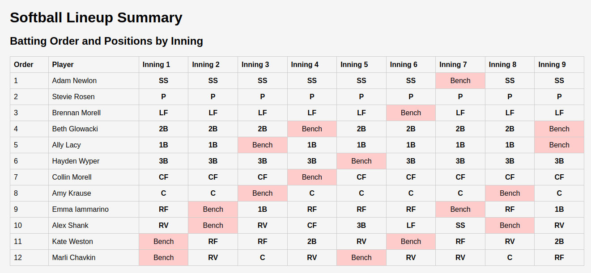

# Softball Lineup Optimization

A tool for optimizing softball team lineups and field positions using linear programming. This project contains two main components:

1. **softball.py** - Creates optimal batting order and fielding positions using linear optimization
2. **webpage.py** - Generates an HTML visualization of the optimization results

## Setup

This project requires Python 3.6+ and the following dependencies:

```bash
pip install pulp
```

## Using the Softball Optimizer (softball.py)

The `softball.py` script creates an optimal batting order and field positions for each inning based on:

- Player batting skills
- Position preferences
- Gender distribution requirements
- Attendance for specific games

### Input Format

The script expects a CSV input file with the following columns:

- **Name** - Player's name
- **Email** - Player's email
- **Is Girl?** - "Yes" or "No"
- **Batting Skill** - Numeric value (lower is better)
- **Will Infield?** - "Yes" or "No"
- **Attendance [date]?** - "Yes" or "No" for each game date
- **Position columns** - "Yes" or "No" for each position (P, C, 1B, 2B, 3B, SS, LF, CF, RF, RV)

### Running the Optimizer

```bash
python softball.py
```

By default, it uses the input file specified in the `INPUT_FILE` variable. You can modify the following constants in the script:

- `INPUT_FILE` - Path to the input CSV
- `ATTENDANCE_KEY` - Date key for the game you're optimizing
- `MIN_NUMBER_GIRLS` - Minimum number of girls required per inning

### Output

The script generates:

1. A console output showing the batting order and field positions for each inning
2. A CSV file in the `outputs` directory with the complete lineup information

## Using the Webpage Generator (webpage.py)

The `webpage.py` script converts the optimizer output into an interactive HTML visualization.

### Running the Webpage Generator

```bash
python webpage.py outputs/rizzler_roster_XX_XX_XXXX.csv
```

Replace `XX_XX_XXXX` with the date of the generated output file.

### Output

The script generates an HTML file in the `outputs_webpages` directory with:

- Complete batting order table with positions for each inning
- Field diagrams for each inning showing player positions
- Clear highlighting for benched players



## Example Workflow

1. Update the CSV input file with current player information
2. Run the optimizer to generate an optimal lineup:
   ```bash
   python softball.py
   ```
3. Generate the HTML visualization:
   ```bash
   python webpage.py outputs/rizzler_roster_01_06_2023.csv
   ```
4. Open the generated HTML file in a browser to view and share the lineup

## Position Legend

- **P** - Pitcher
- **C** - Catcher
- **1B** - First Base
- **2B** - Second Base
- **3B** - Third Base
- **SS** - Shortstop
- **LF** - Left Field
- **CF** - Center Field
- **RF** - Right Field
- **RV** - Rover

## Optimization Criteria

The lineup optimization maximizes:

- Batting skill for batting order (weighted by position)
- Field skill and position preferences
- Fair distribution of playing time
- Gender balance throughout the lineup and field

Both scripts work together to create fair and balanced lineups that adhere to team requirements while maximizing team performance.
